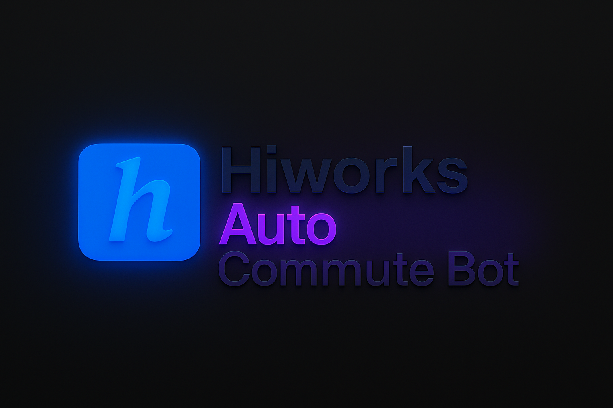

# Hiworks Auto Commute Bot (Self-Hosted)

NestJS 기반의 **하이웍스 자동 출퇴근 봇**입니다.
출근 및 퇴근 시간에 **하이웍스 자동 로그인 → 출퇴근 버튼 클릭 → Slack 알림 전송**을 수행합니다.
또한 Google Calendar의 공휴일 데이터를 기반으로, **공휴일에는 자동 출퇴근을 생략**합니다.

---

## 🚀 빠른 시작 (Docker 기반 배포)

이미 Docker Hub에 빌드된 이미지를 사용하여 `.env`만 설정하면 간편하게 배포할 수 있습니다.

### 1. `.env` 파일 작성

```env
# Hiworks 설정
HIWORKS_LOGIN_PAGE_URI=https://login.office.hiworks.com/example
HIWORKS_MAIN_PAGE_URI=https://home.office.hiworks.com/main
HIWORKS_PERSONAL_PAGE_URI=https://hr-work.office.hiworks.com/personal/index
HIWORKS_LOGIN_EMAIL=your_email
HIWORKS_LOGIN_PASSWORD=your_password

# Google Calendar (대한민국 공휴일 ICS)
GOOGLE_CALENDAR_HOLIDAY_URI=https://calendar.google.com/calendar/ical/ko.south_korea%23holiday%40group.v.calendar.google.com/public/basic.ics

# Slack 알림 설정
SLACK_POST_MESSAGE_URI=https://slack.com/api/chat.postMessage
SLACK_BOT_TOKEN=xoxb-...
SLACK_USER_ID=U12345678
```

> ⚠️ `.env` 파일은 절대 외부에 공개되지 않도록 주의하세요.

### 2. Docker로 실행

```bash
docker run -d --name hiworks-bot \
  --env-file .env \
  rlaeodnr1011/hiworks-bot
```

> 👉 [Docker Hub 이미지 바로가기](https://hub.docker.com/r/rlaeodnr1011/hiworks-bot)

---

## 📦 로컬 설치 (선택적)

```bash
pnpm install
```

### ▶️ 실행

```bash
# 개발 모드
pnpm run start

# 변경 감지 모드 (Hot Reload)
pnpm run start:dev

# 프로덕션 빌드 및 실행
pnpm run build
pnpm run start:prod
```

### ✅ 테스트

```bash
# 단위 테스트
pnpm run test

# E2E 테스트
pnpm run test:e2e

# 커버리지 리포트
pnpm run test:cov
```

---

## 📅 주요 기능

### ✅ 출퇴근 자동화

- 월\~금 오전 **09:45** 출근 체크
- 월\~금 오후 **19:00** 퇴근 체크
- Playwright 기반 브라우저 자동화로 버튼 클릭 수행
- Slack 메시지 전송 (성공 / 실패 메시지 포함)

### ✅ 공휴일 체크

- 매월 1일 Google Calendar ICS에서 공휴일 정보 파싱
- `/holidays/holidays-YYYY.json` 경로에 저장
- 공휴일이면 출퇴근 자동화 스킵

### ✅ 랜덤 지연 실행

- 자동화 탐지 방지를 위해 0\~14분 사이 랜덤 지연 후 동작

---

## 🧪 주의사항

- 하이웍스 UI가 변경되면 자동화가 작동하지 않을 수 있으므로, **정기적 점검이 필요**합니다.
- `.env` 파일에는 민감 정보가 포함되어 있으므로, **절대 외부에 노출하지 마세요.**
- 해당 프로젝트는 개인/사내 자동화 용도로 활용하시고, 서비스 약관 위반이 없도록 유의하세요.

---

## 🪪 라이선스

MIT License
자유롭게 사용/수정 가능하며, 사용 시 라이선스를 명시해주세요.
